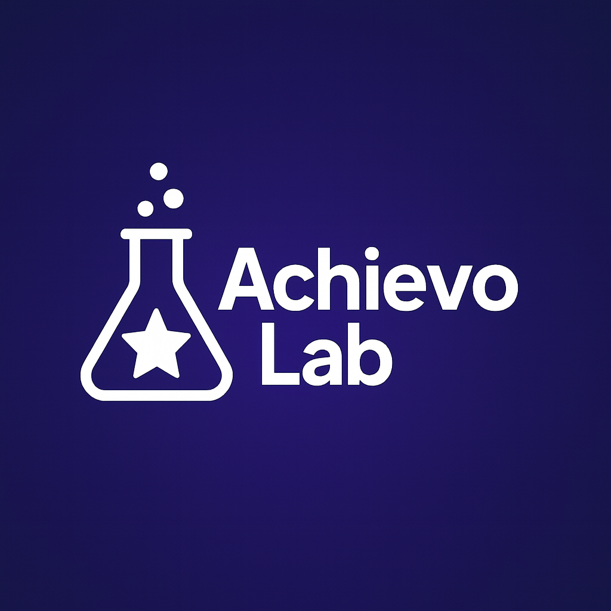
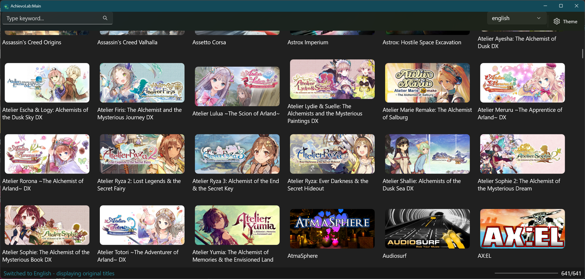
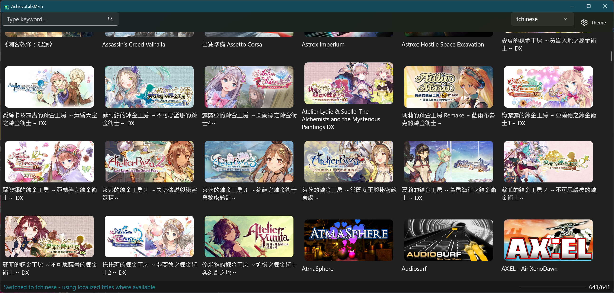
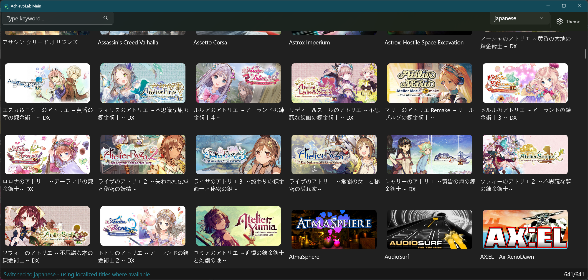

  
  
# AchievoLab
A 64-bit Steam achievement management GUI built with WinUI 3 and .NET 8, compatible with Windows 10 (1904) and Windows 11.

## Features
- Directly wraps the Steamworks API via `steamclient64.dll` to query ownership and metadata of installed apps.
- Provides a dedicated achievement management interface for each game.
- Downloads and caches the global Steam game list.
- Fetches, caches, and reuses cover icons for games.
- Allows launching games directly from the GUI via right-click context menu.
- Retrieves your owned game list and localized game titles (if available) through the Steam Web API.
- Multi-language support for game title / image, if present.

## Technical Notes
- Built with .NET 8 and the Windows App SDK (WinUI 3).
- Interfaces with Steamworks by loading `steamclient64.dll` directly.
- Caches global game data and cover images on disk for faster subsequent launches.
- Consists of three executables: the main UI, a per-game achievement manager, and a Steam Web API fetcher.

## Prerequisites
These apps use framework-dependent deployments. Ensure the target machine has the following runtimes installed:

- [.NET 8 Desktop Runtime](https://dotnet.microsoft.com/en-us/download/dotnet/8.0)
- [Windows App SDK 1.7 Runtime](https://learn.microsoft.com/windows/apps/windows-app-sdk/)

You can install them via [winget](https://learn.microsoft.com/windows/package-manager/winget/):

```powershell
winget install Microsoft.DotNet.DesktopRuntime.8 Microsoft.WindowsAppSDK.1.7
```

## Program List
1. **./AnASM/AnASM.exe**  
   The main GUI interface.
2. **./RunGame/RunGame.exe**  
   Invoked by *AnASM.exe* when a game cover is double-clicked. Used to manage achievements for the selected game.
3. **./MyOwnGames/MyOwnGames.exe**
   Retrieves your owned game data from the Steam Web API.
   ⚠️ Note: This process may take some time. The Steam API may temporarily block your key if requests are made too frequently.

## Screenshots

### AnSAM
  
  
  

### MyOwnGames
  

###

## Using *MyOwnGames*
Unlike AnSAM, MyOwnGames get localized game title data via Steam API. Data shared between AnSAM & MyOwnGames.
To get localized game title data:
1. Obtain a Steam API key from [Steam Developer](https://steamcommunity.com/dev/apikey).  
   ⚠️ Your API key is sensitive and tied to your Steam account. **Do not share it with anyone.**
2. Obtain your **SteamID64**. This tool saves your game list data, which will then be used by the main program (*AnASM*).

## How to Find Your SteamID64
1. Log in to Steam via the client or web browser.  
2. Go to your **Profile** by clicking your username in the top-right corner.  
3. Select **Account details** (or **Edit Profile**).  
4. Your 17-digit SteamID64 will be shown near the top of the page, below your username.  

> If this method no longer works, please look up an updated way to obtain your SteamID64.

### Tuning Steam API throttling

`MyOwnGames` throttles its Steam Web API requests to avoid hitting rate limits. You can adjust these limits in `MyOwnGames/appsettings.json`:

```json
{
  "RateLimiter": {
    "MaxCallsPerMinute": 30,
    "JitterMinSeconds": 1.5,
    "JitterMaxSeconds": 3.0,
    "SteamMaxCallsPerMinute": 12,
    "SteamJitterMinSeconds": 5.5,
    "SteamJitterMaxSeconds": 7.5
  }
}
```

The `SteamMaxCallsPerMinute` and `SteamJitter*` values let you tune Steam-specific throttling separately from the general settings.

## License
This project is licensed under the [MIT License](LICENSE).
It also makes use of cloud game data from [SteamAchievementManager](https://github.com/gibbed/SteamAchievementManager), which is licensed under Zlib.
