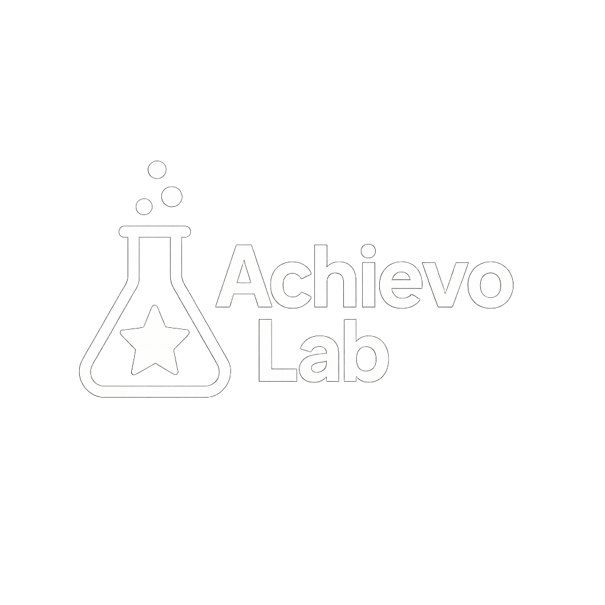

  
  
# AchievoLab
A Steam achievement management GUI, built with WinUI 3 and .NET 8.

## Features
- Wraps the Steamworks API directly via `steamclient64.dll` to query ownership and metadata for installed apps.
- Launch dedicated game achievement management interface.
- Downloads and caches the global game list.
- Fetches, caches and reuses cover icons for games.
- Can launches games through GUI by right click popup menu.
- Also can launch game from this UI by right click menu.

## Getting Started
1. Install the [.NET 8 SDK](https://dotnet.microsoft.com/download).
2. Clone the repository and restore dependencies:
   ```bash
   git clone https://github.com/bbfox0703/AchievoLab.git
   cd AchievoLab
   dotnet restore AnSAM.sln
   ```
3. Build the WinUI application (requires Windows 10 17763 or later):
   ```bash
   dotnet build AnSAM.sln -p:EnableWindowsTargeting=true
   ```
4. Run the application:
   ```bash
   dotnet run --project AnSAM.csproj -p:EnableWindowsTargeting=true
   ```

## Program list
1. ./AnASM/AnASM.exe: primary GUI interface.
2. ./RunGame/RunGame.exe: called by AnASM.exe when double click on a game title image.
3. ./MyOwnGames/MyOwnGames.exe: This tool is designed to get your Steam account owned game data by Steam Web API.

## To use MyOwnGames
1. Need a Steam API key. (Apply API key here)[https://steamcommunity.com/dev/apikey]. Please note API key is very important to your Steam account. Don't share it to anyone.
2. Need your SteamID64 number: Several ways to get this. If you did not customize your Steam personal page URL end with ...profiles/7656119xxxxxxxx. Where 7656119xxxxxxxx is your SteamID64 number. Or you can get it from SteamDB after link logon info with Steam.
This tool save your game list data and will be used for main program AnSAM. 

## Tests
Unit tests cover some core services of AnSAM itself, such as icon caching. Run them with:
```bash
dotnet test AnSAM.Tests/AnSAM.Tests.csproj
```

## License
This project is licensed under the MIT License. See [LICENSE](LICENSE) for details.
Use origin SteamAchievementManager cloud game data source, this part is Zlib license.
